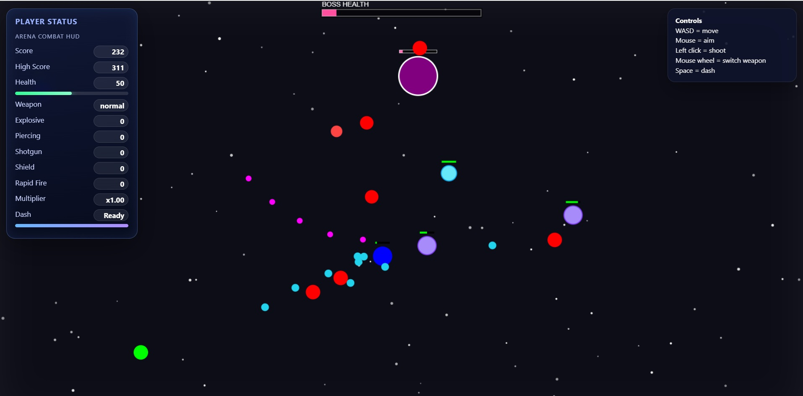

###

This repositio contains a game what is almost fully done by AI. This is part of a Cloud services course, where is one task to do simple game with using AI.

###

In this project is tested ChatGPT, Grok, Copilot and Codex. Grok and ChatGPT (chat version) looks that them can't handle many files good but Copilot and Codex do this size of project almost without problems.

###

Gameplay photo:

For playing this game, you might start live server.